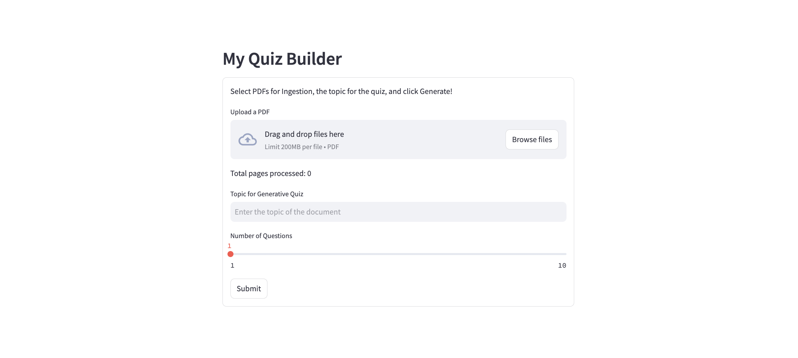

# Gemini-AI-Quizify

This project is a Quiz Builder constructed using a combination of technologies, including Google Gemini, Vertex AI API, 
embeddings, a Google Service Account, Langchain, a PDF loader, and Streamlit. Developed as a response to a Radical AI challenge, 
the project focuses on specific implementation steps within the Quiz Builder framework.

## Acknowledgments

This project is based on [mission-quizify](https://github.com/radicalxdev/mission-quizify), developed by [radicalxdev](https://github.com/radicalxdev). 
I want to thank them for providing the foundation for this project.

## Description

The Quiz Builder is capable of generating quizzes based on both uploaded documents and user-specified topics. 
Leveraging machine learning models for text embeddings, the system 
employs Google's Gemini and Vertex AI API to process documents and construct quizzes. 

## Demonstration

